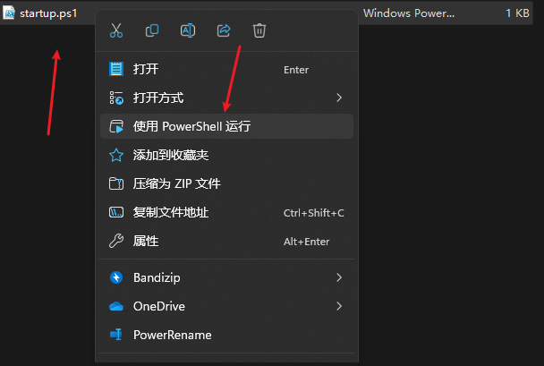
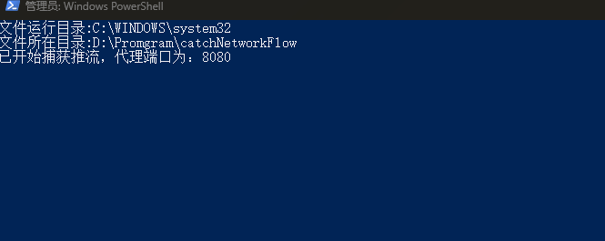
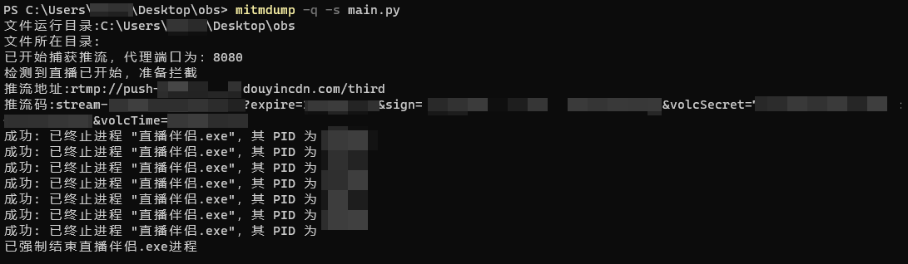
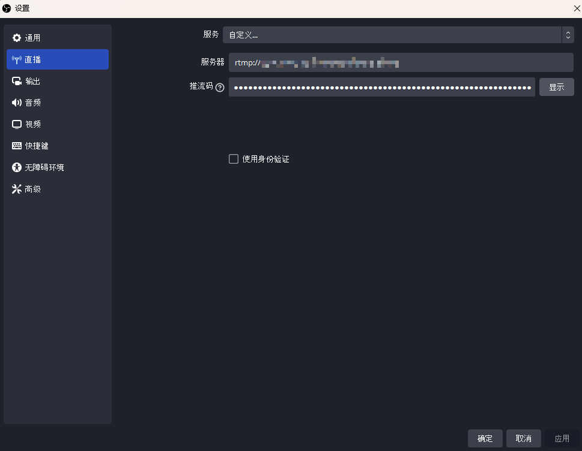

# 抖音直播RTMP推流码捕获

具体实现参考我博客的文章：[抖音直播伴侣捕捉RTMP直播推流码的方式与实现](https://0chen.cc/2023/05/28/%E6%8A%96%E9%9F%B3%E7%9B%B4%E6%92%AD%E4%BC%B4%E4%BE%A3%E6%8D%95%E6%8D%89RTMP%E7%9B%B4%E6%92%AD%E6%8E%A8%E6%B5%81%E7%A0%81%E7%9A%84%E6%96%B9%E6%B3%95%E4%B8%8E%E5%AE%9E%E7%8E%B0/)

## 使用方法
环境要求：python3，mitmproxy，proxifier4 se
```shell
pip install requests
pip install mitmproxy
```
通过startup.ps1启动本程序，当出现提示时说明程序正常运行，如果出现8080端口占用，请修改ps1文件，使用mitmdump创建新的监听端口。






使用https协议代理127.0.0.1:8080，访问https://mitm.it/下载对应证书，根据官方推荐流程进行安装证书。

随后启动直播伴侣，点击开播，脚本会在检测到开播的同时将直播伴侣的进程kill掉以及将直播url以及推流码推上来



在obs-直播选项中，选择自定义将推流地址以及推流码填入即可使用obs代替直播伴侣进行直播。



## 声明
本项目遵循GPL v3，请勿进行商用。
